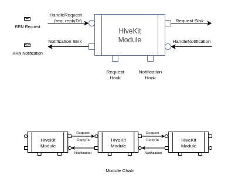

# HiveKit - HiveOT Development Kit

HiveKit provides modules for building lightweight IoT applications for integration with the Web of Things.

The core concept is that an application is build by combining modules that each provide needed capabilities. Interactive modules define their capabilities using a W3C Thing Description (TD) document. Modules are linked in a chain. Each module watches for request messages with operations directed at their thingID. Modules emit notifications for events and property updates.

The standard module has an extremely simple interface: A handler for request messages with a replyTo callback, and a handler for notification messages. Modules are linked by setting a request sink to the request handler of the next module in the chain. Similarly a notification sink is set to the notification handler from the upstream module.

## Project Status

(updated april 2026)

Many modules are implemented in golang. Javascript and Python integration is planned. Using transport modules it is easy to link Javascript, Python and golang modules with minimal overhead.
Modules with a checkmark are functional but breaking changes can still be expected for those marked as alpha or beta.

Core Service modules:

| status | module      | description                       | stage |
| :----: | ----------- | --------------------------------- | ----- |
|   ✔️   | authn       | Client authentication             | alpha |
|   ✔️   | authz       | Role based authorization          | alpha |
|   ✔️   | bucketstore | Key-value data storage            | alpha |
|   ✔️   | certs       | Certificate management            | alpha |
|   ✔️   | digitwin    | Digital twin                      | alpha |
|   ✔️   | directory   | Thing directory                   | alpha |
|   ✔️   | factory     | Module factory                    | alpha |
|   ✔️   | history     | Message history recorder          | alpha |
|   ✔️   | logging     | Basic messaging logging           | alpha |
|   ✔️   | router      | Message routing to remote devices | alpha |
|   ✔️   | vcache      | Value cache                       | alpha |
|   ⬛   | jsscript    | Javascript based automation       | todo  |
|   ⬛   | rules       | Rule based automation             | todo  |

[Transport modules](docs/transports.md):

| status | module               | description                           | stage |
| :----: | -------------------- | ------------------------------------- | ----- |
|   ✔️   | transport/discovery  | WoT mDNS device discovery             | alpha |
|   ✔️   | transport/grpc       | HiveOT gRPC fast message streaming    | alpha |
|   ✔️   | transport/httpbasic  | WoT HTTP basic messaging protocol     | alpha |
|   ✔️   | transport/httpserver | HTTP server for sub-protocols         | alpha |
|   ✔️   | transport/ssesc      | HiveOT HTTP/SSE-SC messaging protocol | alpha |
|   ✔️   | transport/wss        | WoT Websocket messaging protocol      | alpha |
|   ⬛   | transport/mqtt       | WoT MQTT messaging protocol           | n/a   |

Integration Binding Modules:

| status | module   | description                     | stage |
| :----: | -------- | ------------------------------- | ----- |
|   ⬛   | ipnet    | IP Network monitor              | todo  |
|   ⬛   | isy99x   | ISY 99 gateway binding          | todo  |
|   ⬛   | owserver | 1-wire owserver gateway binding | todo  |
|   ⬛   | zwavejs  | ZWave binding using zwave-js    | todo  |
|   ⬛   | weather  | Weather service bindings        | todo  |
|   ⬛   | lorawan  | LoRaWan gateway binding         | todo  |
|   ⬛   | canbus   | Canbus gateway binding          | todo  |
|   ⬛   | ...      | and many more...                | todo  |

## HiveKit Modules

HiveKit modules are 'Things' and offer their capabilities by exposing a WoT TD (Thing Description) document that describes its properties, events and actions. Interaction takes place by creating a RequestMessage with optional input and passing it to the module.

A [HiveKit module](hivekit-module.png) MUST implement the IHiveModule interface. This interface governs the interaction with the module and enables the ability to add their functionality to a chain of modules.

The IHiveModule interface describes how to link a module to the next module in the chain. The link consists of a request handler to pass request messages down the chain and respond with a response message, and a notification handler to pass notification messages up the chain. Applications can use the hooks to intercept requests and notifications. A 'HiveModuleBase' helper is available that implements this interface and supports linking of modules. HiveModuleBase is used by most HiveKit modules.

HiveKit modules interact using _RRN_ Request-Response and publish-subscribe Notification messages. HiveKit combines the strengths of these two messaging patterns into a simple and easy to use messaging framework for connecting modules. RRN messages define an envelope that describes a WoT operation, the Thing to address, the name of the message, and its payload, as described in the [W3C WoT Thing Description](https://www.w3.org/TR/wot-thing-description11/).

### Module Types

The following types of modules can be distinguished:

1. Service modules offer a service, such as authentication, logging and routing. Service modules can be configured through properties and queried using actions.

2. Transport modules come in two flavors, a transport client and a transport server module. The client module passes requests to the server and the server module passes requests and notifications to the client. Client-Server module pairs are available for multiple protocols such as http-basic, websockets and others. Subscriptions are handled by server side connections.

### Module Factory

Modules in HiveKit are not applications themselves but intended to construct an application. The [factory module](go/modules/factory/README.md) facilitates building applications by chaining modules defined in a recipe. This chaining aggregates functionality provided by each module. Application capabilies can be modified by changing the modules in the chain.

Application specific logic can easily be incorporated using module hooks, or by providing application logic as a module itself and adding this module to the recipe.

## About HiveOT

Security is big concern with today's IoT devices. The Internet of Things contains billions of devices that when not properly secured can be hacked too easily. Unfortunately the reality is that the security of many of these devices leaves a lot to be desired. Many devices are vulnerable to attacks and are never upgraded with security patches. This problem is only going to get worse as more IoT devices are coming to market. A botnet of a billion IoT devices can bring parts of the Internet to its knees and cripple essential services. The cost to businesses and consumers reaches hundreds of millions of dollars yearly.

Exposing IoT devices to the internet for direct use by consumers is therefore simply a very very bad idea from a security point of view, and does not meet the needs of todays reality. And yet, for some reason every year more and more IoT devices hit the market that run their own server and are exposed to the internet.

While HiveKit lets you build individual IoT devices that run their own server (please don't), it should be clear by now that this is, well ..., a very very bad idea.

HiveOT aims to aid in improving security of the IoT ecosystem by:

1. Not run a server on IoT devices. Instead IoT devices connect to a secured gateway or hub. These devices have the RC (reverse connection) capability which is readily supported by all HiveKit transport modules. Just swap a server module for its client counterpart.
2. Offer an easy way to build a gateway or hub that supports RC capable devices. This is equivalent to building a server that forwards request to connected clients using the router module.
3. Support an easy way to expand the application functionality with custom modules without having to be a security expert.
4. Support the W3C WoT standard for interacting with IoT devices including authentication, authorization, directory, history and other capabilities.
5. Define a development commitment (see below) when using HiveOT software.

HiveOT is based on the [W3C WoT TD 1.1 specification](https://www.w3.org/TR/wot-thing-description11/) for interaction between IoT devices and consumers. It aims to be compatible with this standard.

Integration with 3rd party IoT protocols is supported through the use of protocol binding modules. These modules translate between the 3rd party IoT protocols and RRN (request/response/notification) messages. The RRN messages can be linked to a WoT protocol for interaction with WoT compatible clients using properties, events and actions.

## Developer Commitment

This project is aimed at software developers for building secure IoT solutions. When adopting HiveKit, developers agree to:

1. Support the security mandate that individual IoT devices should remain isolated from the internet. See above for the motivation and rational of this critical aspect.
2. Support the use of RC (reverse connection) enabled devices that connect to a secured gateway or hub. When possible, promote this approach with the WoT working group.
3. Agree to regularly provide security fixes with firmware updates if needed.

This probably needs a modified MIT license but that is beyond the scope of this project.

## Getting Started

### Build

This project uses golang 1.25 or newer.

To debug with vscode delve must be installed. To get the latest (on linux):

> go install github.com/go-delve/delve/cmd/dlv
> export $PATH=$PATH:~/go/bin
> go mod tidy

### Use

The easiest way to get started is to use the factory module with one of the example recipes. There are recipes for constructing stand-alone IoT devices, a WoT compatible gateway, a digital twin hub, and client applications. [see factory for details](go/modules/factory/README.md)

... this section is under development...
