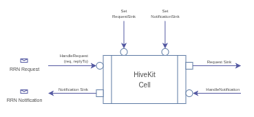

# HiveKit - HiveOT Development Kit

HiveKit provides 'cells' for building lightweight IoT applications for integration with the Web of Things.

Applications are build by combining cells that each provides a needed capability. Interactive cells define their capabilities using a W3C Thing Description (TD) document. Cells are linked in a chain, star or other configuration. Each cell handles request messages directed at their thingID and forward requests for other Things. Cells emit notifications for events and property updates which are send to the linked upstream cell.

The standard cell has a simple interface: A handler for request messages with a replyTo callback, and a handler for notification messages. Cells are linked by setting a request sink to the next cell in the chain. Similarly a notification sink is set to the upstream cell.

[](#hivekit-cells)

All interaction takes place using RRN (request-response-notification) messages. These contain an operation, Thing-ID, affordance name and optiona input and output payloads.

## Project Status

HiveKit is in alpha development (June 2026).

Most cells are implemented in golang. Javascript and Python integration is planned. Using transport cells it is easy to link Javascript, Python and golang cells with minimal overhead.
Cells with a checkmark are functional but breaking changes can still be expected for those marked as alpha or beta.

Core Service cells:

| status | cell         | description                        | stage |
| :----: | ------------ | ---------------------------------- | ----- |
|   ✔️    | authn        | Client authentication              | alpha |
|   ✔️    | authz        | Role based authorization           | alpha |
|   ✔️    | bucketstore  | Key-value data storage             | alpha |
|   ✔️    | certs        | Certificate management             | alpha |
|   ✔️    | consumer     | Consumer of IoT data               | alpha |
|   ✔️    | digitwin     | Digital twin                       | alpha |
|   ✔️    | directory    | Thing directory server & client    | alpha |
|   ✔️    | exposedthing | Thing producing of IoT data        | alpha |
|   ✔️    | factory      | Cell factory                       | alpha |
|   ✔️    | history      | Message history recorder           | alpha |
|   ✔️    | logging      | Basic messaging logging            | alpha |
|   ✔️    | reconnect    | Restore dropped client connections | alpha |
|   ✔️    | router       | Message routing to remote devices  | alpha |
|   ✔️    | vcache       | Value cache                        | alpha |
|   ⬛    | jsscript     | Javascript based automation        | todo  |
|   ⬛    | rules        | Rule based automation              | todo  |

[Transport cells](docs/transport.md):

Transport cells come with a server and a client cell.

| status | cell                | description                           | stage |
| :----: | ------------------- | ------------------------------------- | ----- |
|   ✔️    | transport/discovery | WoT mDNS device discovery             | alpha |
|   ✔️    | transport/grpc      | HiveOT gRPC fast message streaming    | alpha |
|   ✔️    | transport/httpbasic | WoT HTTP basic messaging protocol     | alpha |
|   ✔️    | transport/tlsclient | HTTP client for sub-protocols         | alpha |
|   ✔️    | transport/tlsserver | HTTP server for sub-protocols         | alpha |
|   ✔️    | transport/ssesc     | HiveOT HTTP/SSE-SC messaging protocol | alpha |
|   ✔️    | transport/wss       | WoT Websocket messaging protocol      | alpha |
|   ⬛    | transport/mqtt      | WoT MQTT messaging protocol           | n/a   |

Integration Binding Cells: (this will mobe to the HiveOT Hub)

| status | cell     | description                     | stage |
| :----: | -------- | ------------------------------- | ----- |
|   ⬛    | ipnet    | IP Network monitor              | todo  |
|   ⬛    | isy99x   | ISY 99 gateway binding          | todo  |
|   ⬛    | owserver | 1-wire owserver gateway binding | todo  |
|   ⬛    | zwavejs  | ZWave binding using zwave-js    | todo  |
|   ⬛    | weather  | Weather service bindings        | todo  |
|   ⬛    | lorawan  | LoRaWan gateway binding         | todo  |
|   ⬛    | canbus   | Canbus gateway binding          | todo  |
|   ⬛    | ...      | and many more...                | todo  |

## HiveKit Cells

HiveKit cells are building blocks for building devices and applications. Cells follow the separation of concerns paradigm where each cell is performs a single task. Applications are build by combining cells. 

Each cell has an instance ID that can be used as a thing-ID. Where applicable, their capabilities can be described by a WoT TD (Thing Description) document that describes its properties, events and actions. Interaction takes place by creating a RequestMessage with an operation and the cell-ID and sending it to the cell.

A [HiveKit cell](hivekit-cell.png) MUST implement the IHiveCell interface. This interface defines how to interact with the cell and enables the ability to add their functionality to a hive of cells.

The IHiveCell interface describes how to link a cell to another cell to form a chain or other configuration. The link consists of a request handler to pass request messages to the next cell and respond with a response message, and a notification handler to pass notification messages up the chain. A 'HiveCellBase' helper is available that implements this interface and supports linking of cells. HiveCellBase is used by most HiveKit cells.

HiveKit cells interact using _RRN_ Request-Response and publish-subscribe Notification messages. HiveKit combines the strengths of these two messaging patterns into a simple and easy to use messaging system for connecting cells. RRN messages define an envelope that describes a WoT operation, the Thing to address, the name of the message, and its payload, as described in the [W3C WoT Thing Description](https://www.w3.org/TR/wot-thing-description11/).

### Cell API

All cells support the HiveKit cell API defined as IHiveCell. This API defines how to handle requests and responses.


```go
// The golang HiveOT cell interface. The JS and Python implementation will offer something similar.
type IHiveCell interface {

	// GetThingID returns the cell's instance ID.
	GetThingID() string

	// Handle the notification received from a producer.
	// The default behavior is to forward it upstream to the handler set with SetNotificationSink.
	HandleNotification(notif *msg.NotificationMessage)

	// HandleRequest processes or forwards a request downstream.
	HandleRequest(request *RequestMessage, replyTo(resp *ResponseMessage)) error

	// Set the handler of notifications emitted by this cell
	SetNotificationSink(consumer IHiveCell,thingIDs ...string)

	// SetRequestSink sets the handler of requests emitted by this cell.
	SetRequestSink(sink IHiveCell)

	// Start readies the cell for use
	Start() error
	Stop()
}
```

### Cell Types

There are two fundamental types of cells, producers and consumers of information. Producers handle requests and publish information while consumers publish requests and receive notifications. An IoT device is typically a producer while an end-user interacts using a consumer cell. In between a producer and consumer there can be many other cells at work that act as a producer, consumer or both.


The following cell categories can be distinguished:

1. Service cells are producers that offer a service, such as authentication, logging and routing. Service cells can be configured through properties and queried using actions.

The ExposedThing cell helps writing producers. It provides methods for publishing notifications, tracking state and handle requests to read properties.

2. Middleware cells are a class of cells whose purpose is to analyze, filter and route messages. For example, logging, authorizing, routing are middleware tasks. These cells act as producers for consumers and consumers for producers.

3. Transport cells role is to link cells over the network. They come in two flavors, a transport client and a transport server cell. The client cell sends requests to the server and the server cell sends requests and notifications to the client. Client-Server cell pairs are available for multiple protocols such as http-basic, websockets, gRPC and others. Server cells track event subscriptions and subscriptions to observe properties made via the client.

4. Consumer cells collect information from producers. Consumers publish requests for information and receive responses and notifications. Services that aggregate, transform or enrich information are consumers of that information. A user interface for example is a consumer that presents information. 
   
The 'Consumer' cell implementation helps writing consumers by providing methods for publishing requests and subscribing to event and property notifications.

## Linking Cells

A core capability of cells is the ability to chain them together. Chains offer application level functionality. A chain can operate on a single computer system or include cells across multiple computer systems linked by transport cells. This allows for creating a powerful distributed IoT solution with small lightweight cells that require few resources and are simple to maintain.

Creating a cell chain can be done manually by programatically linking cells, or dynamically by providing a recipe to the factory service. 

### Cell Factory

Cells in HiveKit are not applications themselves but intended to construct an application. The [factory cell](go/cells/factory/README.md) facilitates building applications by chaining cells defined in a recipe. This chaining aggregates functionality provided by each cell. 

Application specific logic can easily be incorporated using the hooks provided by the exposed-thing cell, or by providing application logic as a cell itself and adding this cell to the recipe.


### Adding Cells

One of the goals of HiveKit is to make it easy to add compatible cells.

To develop a cell implement its IHiveCell interface. The provided CellBase implements the little boilerplate that is needed. The HandleRequest method is the most important method to implement. Exposing a TM is recommended for IoT devices.

To use a cell connect it as the sink of the previous cell in the chain. In case of an IoT device the previous cell can be one of the messaging server cells. The server passes requests to the HandleRequest method which the cell must implement, and responses are returned to the sender. Notifications emitted by the cell are passed to the registered notification handler which is the server cell.


## About HiveOT

Security is big concern with today's IoT devices. The Internet of Things contains billions of devices that when not properly secured can be hacked too easily. Unfortunately the reality is that the security of many of these devices leaves a lot to be desired. Many devices are vulnerable to attacks and are never upgraded with security patches. This problem is only going to get worse as more IoT devices are coming to market. A botnet of a billion IoT devices can bring parts of the Internet to its knees and cripple essential services. The cost to businesses and consumers reaches hundreds of millions of dollars yearly.

Exposing IoT devices to the internet for direct use by consumers is therefore simply a very very bad idea from a security point of view, and does not meet the needs of todays reality. And yet, for some reason every year more and more IoT devices hit the market that run their own server and are exposed to the internet.

While HiveKit lets you build individual IoT devices that run their own server (please don't), it should be clear by now that this is, well ..., a very very bad idea.

HiveOT aims to aid in improving security of the IoT ecosystem by:

1. Not run a server on IoT devices. Instead IoT devices connect to a secured gateway or hub. These devices have the RC (reverse connection) capability which is readily supported by all HiveKit transport cells. Just swap a server cell for its client counterpart.
2. Offer an easy way to build a gateway or hub that supports RC capable devices. This is equivalent to building a server that forwards request to connected clients using the router cell.
3. Support an easy way to expand the application functionality with custom cells without having to be a security expert.
4. Support the W3C WoT standard for interacting with IoT devices including authentication, authorization, directory, history and other capabilities.
5. Define a development commitment (see below) when using HiveOT software.

HiveOT is based on the [W3C WoT TD 1.1 specification](https://www.w3.org/TR/wot-thing-description11/) for interaction between IoT devices and consumers. It aims to be compatible with this standard.

Integration with 3rd party IoT protocols is supported through the use of protocol binding cells. These cells translate between the 3rd party IoT protocols and RRN (request/response/notification) messages. The RRN messages can be linked to a WoT protocol for interaction with WoT compatible clients using properties, events and actions.

## Developer Commitment

This project is aimed at software developers for building secure IoT solutions. When adopting HiveKit, developers agree to:

1. Support the security mandate that individual IoT devices should remain isolated from the internet. See above for the motivation and rational of this critical aspect.
2. Support the use of RC (reverse connection) enabled devices that connect to a secured gateway or hub. When possible, promote this approach with the WoT working group.
3. Agree to regularly provide security fixes with firmware updates if needed.

This probably needs a modified MIT license but that is beyond the scope of this project.

## Getting Started

### Build

This project uses golang 1.25 or newer.

To debug with vscode delve must be installed. To get the latest (on linux):

> go install github.com/go-delve/delve/cmd/dlv
> export $PATH=$PATH:~/go/bin
> go mod tidy

### Use

The easiest way to get started is to use the factory cell with one of the example recipes. There are recipes for constructing stand-alone IoT devices, a WoT compatible gateway, a digital twin hub, and client applications. [see factory for details](go/cells/factory/README.md)

... this section is under development...
