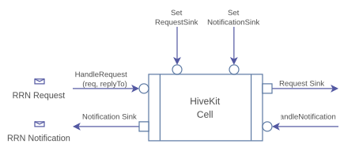
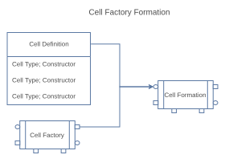

# HiveKit Cell Basics

HiveKit cells are building blocks for building devices and applications. Cells follow the [separation of concerns principle](https://en.wikipedia.org/wiki/Separation_of_concerns) where each cell performs a single task. Applications are build by linking cells. 

The standard cell has a simple interface: A handler for request messages with a replyTo callback, and a handler for notification messages. Cells are linked by setting a request sink to the next cell downstream. Similarly a notification sink is set to the upstream cell.

Each cell has a cell instance ID that can be used as a thing-ID. Where applicable, their capabilities can be described in a WoT TD (Thing Description) document that describes its properties, events and actions. 

HiveKit cells interact using Request-Response and publish-subscribe Notification messages. HiveKit combines the strengths of these two messaging patterns into a simple and easy to use messaging system for connecting cells. RRN messages define an envelope that describes a WoT operation, the Thing to address, the name of the message, and its payload, as described in the [W3C WoT Thing Description](https://www.w3.org/TR/wot-thing-description11/).

## Cell Types

The following type of cells can be distinguished:

1. Device cells represent an IoT sensor or actuator. Developing these cells is supported by using the 'ExposedThing' cell.
   
    The [ExposedThing cell](../go/cells/thing/README.md) includes methods for publishing notifications, tracking property state and handle requests to read properties.
   
2. Service cells are Things that offer a service, such as authentication, logging and routing. Service cells can be configured through properties and queried using actions. Services can also act as a consumer when they collect and process information. Services can also bridge 3rd party services such as a weather provider.

3. Middleware cells are cells whose purpose is to analyze, filter and route messages. For example, logging, authorizing, routing are middleware tasks. 

4. Transport cells role is to link cells over the network. A transport client cell connects to a corresponding transport server cell. Request, response and notification messages are send between client and server cells as defined by the transport protocol. Client-Server cell pairs are available for multiple protocols such as http-basic, websockets, gRPC and others. Server cells track event subscriptions and subscriptions to observe properties made via the client.

5. Protocol binding cells bridge IoT protocols such as zwave, one-wire, and many others. These cells typically represent multiple things that are provided through the IoT protocol.

6. Consumer cells collect information from IoT devices and services. Consumers publish requests for information and receive responses and notifications. 
   
The 'Consumer' cell implementation helps writing consumers by providing methods for publishing requests and subscribing to event and property notifications.

## Linking Cells

A core capability of cells is the ability to link them together. 

Cells can be linked directly, between processes, or across computer systems systems using transport cells and include a gateway. This allows for creating a distributed IoT solution with small lightweight cells that require few resources and are simple to maintain.

Linking cells is often done in a formation, such as a chain, star, or bus. The chain formation can include another formation. See the [gateway recipe](../go/factory/recipes/gateway/GatewayRecipe.go) for an example of using a bus formation inside a chain formation.

Creating a cell formation can be done manually by programatically instantiating and linking cells, dynamically by using a factory formation, or using or creating a factory recipe. 

## Cell Factory 

Cells in HiveKit are not applications themselves but intended to construct an application. The [cell factory](../go/factory/README.md) facilitates building applications by linking cells defined in a recipe. This linking aggregates functionality provided by each cell. 

Application specific logic can easily be incorporated using the hooks provided by the exposed-thing cell, or by embedding an exposed thing in the application logic itself and adding this cell to a factory formation.

When created, cells can be used immediately. The 'Start' method of a cell is intended to activate the interaction and should be called after all cells in the application are instantiated and linked. This ensures that requests and notifications from autonomous operations can be delivered to their intended destination. 

Invoking Start on the factory or recipe, if used, will invoke it on all cells. The recommended approach is therefore to create and link all cells first using the factory or recipe, and run Start on the factory to start running the application.

## Factory Formation and Recipes

A factory formation consists of a list of cell definitions that is passed to a formation along with a cell factory instance. The formation instantiates cells using the factory and links the cells according to its formation rules. The result is called a recipe.

A recipe contains a formation with a predefined set of cells for a specific purpose. A recipe can add additional logic to the formation to aid building an application. There are recipes for building a gateway, IoT device, and a consumer. Users can create their own recipes and even change the formation used dynamically based on input parameters.

## Adding Cells

One of the goals of HiveKit is to make it easy to add compatible cells.

To develop a cell implement its IHiveCell interface. The provided CellBase implements the little boilerplate that is needed. The HandleRequest method is the most important method to implement. Exposing a TM is recommended for IoT devices.

To use a cell connect it as the sink of the previous cell in the chain. In case of an IoT device the previous cell can be one of the messaging server cells. The server passes requests to the HandleRequest method which the cell must implement, and responses are returned to the sender. Notifications emitted by the cell are passed to the registered notification handler which is the server cell.
