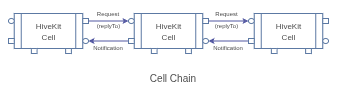

# HiveKit Cell Factory

The cell factory is intended to create a complete application out of cells using the provided environment. 

While cells can be used stand-alone, use of factory recipes make it easy to construct an application while only needing to focus on the application logic itself. 

Recipes are a companion to the factory that constructs a cell chain or star formation from a declared recipe. A recipe is a cell itself that passes requests to the cells in the recipe and returns notifications from the recipe cells. 



## Status

The factory and recipe cells are in alpha. They are functional but breaking changes can be expected.

## Summary

The purpose of the factory is the simplify instantiation and linking of (golang) cells for a client or server applications along with the needed environment. It operates using a collection of registered cells. 3rd party cells can easily be added to the registry. 

To develop an application the application logic can be placed in a cell itself and linked to a recipe. The recipe handles the needed capabilities for discovery, communication, storage and much more.

Each cell is registered using a cell type-name and a default implementation. The cell type identifies the interface of the cell implementation. Cells can be replaced with custom functionality as long as the replacement implements the interface for that cell type.

Applications can instantiate a cell using 'GetCell(cellType)'. The cell uses the factory provided environment to obtain directory locations, certificates as needed. In case of clients the environment offers the server URL which can be set manually or by the discovery service.

The recipes folder contains a set of convenient cookie-cutter recipies for building consumers, Things and gateways. See also the examples to see how they are used for creating a test device and a consumer cli.

### Recipe Creation

Recipes are the quickest way to build a client or server application or plugin. They specify wich cells are used and how they are chained.

A recipe contains a map of cell factory functions by their cell type, and a list of cells in the order they are linked. An application is instantiated by invoking recipe.Start(factoryInstance).

Use of recipes is optional as a user can also just load cells with the factory using GetCell(cellType) and link them manually using SetRequestHandler and SetResponseHandler.

### Inter-process and Multi-Language Recipes

The factory is written in golang and can only instantiate cells running in the same process. Cells written in a different program language or running on a different host cannot be started.

It is possible however to build an application consisting of cells on different platforms by connecting them through a transport client/server or by using an application gateway. The gateway recipe can be expanded to include local business logic and accept connections from javascript or python cells that run on the same or separate hosts. 


### Including 3rd party cells

3rd party cells can be included if they are written in golang. For 3rd party cells written in different languages it is better to define them as plugins. A javascript and python implementation of the factory is planned to simplify writing IoT applications and plugins in those languages.

## Application Environment

Since many cells operate in an environment that uses files, credentials or network access, it helps to centralize the configuration of this environment and instantiate cell instances using this environment.

The first step is therefore to setup the environment:

> env := api.NewAppEnvironment(homedir, withFlags)

Where 'withFlags' allows control of the home and other directories uses commandline flags.

After generating the environment it is used to instantiate the factory and its cells.

### Directory Structure

The homeDir is the root of application. This can follow two approaches, a user home or a system home directory.

When a user home directory is chosen this defines the following application folder structure (on Linux):

```
~/bin/myapp
        |- bin               Application binaries, cli and launcher
        |- plugins           Plugin binaries controlled by the launcher
        |- config            Service configuration yaml files
        |- certs             CA and service certificates
        |- logs              Logging output
        |- run               PID files and sockets
        |- stores
            |- {service}    Data storage for services such as authn
```

When a system home directory is chosen it should be a directory /opt/{appname}. This defines the following folder structure:

```
/opt/{appname}/bin            Application binaries, cli and launcher
/opt/{appname}/plugins        Plugin binaries that are started and stopped using the launcher
/etc/{appname}/conf.d         Service configuration yaml files
/etc/{appname}/certs          CA and service certificates
/var/log/{appname}/           Logging output
/run/{appname}/               PID files and sockets
/var/lib/{appname}/{service}  Storage of service data
```

A Windows directory structure can be accomodated by setting the paths directly.

### Commandline arguments

When building an application it is not uncommon to be able to specify different directories from the commandline.

NewAppEnvironment uses the golang 'flag' library to allow overriding the directories with a corresponding flag:

```
-home         select a different application home directory
-config       select a different configuration file directory
-configFile   select the primary configuration file that holds all cell configurations
-logLevel     logging level, debug, info, warn (default), error
-clientID     application clientID when authenticating with a server (for clients)
-serverURL    select a different server (for clients)

```

### Certificates

Servers need certificates and these certificates need to be created somehow. The environment expects certificates to exist in the configured 'certs' directory.
If they don't exist during initialization a set of self-signed CA and server certificates will be created when a transport server is instantiated.

```
- caCert.pem     - the CA certificate.
- caKey.pem      - the generated CA key for self-signed certificate.
- serverCert.pem - the server x509 certificate in PEM format used by the transport.
- serverKey.pem  - the server private key in PEM format.
```

### Keys

Services that run stand-alone and connect to a server need keys (bearer tokens) to authenticate. These are also stored in the certs directory and are read-only to the user that runs the factory.

The key file has the application-ID as the filename with ".key" as the suffix. The keys can be generated manually using a commandline utility or automatically through a launcher service if used. By default the application-ID is the name of the binary.

If the server side uses the authn service for authentication (recommended) then the keys must be generated using this service.

The cli and launcher mentioned above are applications build with HiveKit. See the go/apps directory for details.


## Application Example

The easiest method to build an application is to use one of the predefined recipes and add the application specific cells. Below some pseudocode for illustration. See also the examples section.

```go (tenative)
func main(){
    // collect the cells to include. Predefined recipes already contain the cells for common use-cases.
	env := api.NewAppEnvironment("~/bin/hiveot", true)
	f := factory_service.NewCellFactory(env, nil)
    recipe := NewStandAloneDeviceRecipe(f)
    // register the recipe cells with the factory and start them.
    err = recipe.Start()
    if err != nil {
        return 
    }

    // create your application and link it to the recipe
    appCell := NewMyAppCell()
    // A: have the recipe handle requests (consumers)
    appCell.SetRequestSink(recipe)
    recipe.SetNotificationSink(appCell)
    // B: have the recipe pass requests (IoT devices and services)
    recipe.SetRequestSink(appCell)
    appCell.SetNotificationSink(recipe)

    appCell.Start()

    // wait for Control-C or other signal to end the application
    f.WaitForSignal(context.Background())
    // Graceful shutdown of all cells in the factory
    f.Stop()
}
```
This is all that is needed to include hivekit and other cells in your application. The developer only needs to provide 'appCell' which provides the application logic and interacts with request handler and notification handlers.

