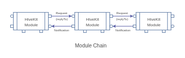

# HiveKit Module Factory

The module factory creates module instances for the configured environment. Use of the factory is optional. It does make life easier though so give it a spin.

The factory is a module itself that passes requests to the chain of loaded modules and returns notifications. The factory supports the ability to create a chain from a recipe that defines the modules to be included and the order they are linked.



## Status

This module is in alpha. It is functional but breaking changes can be expected.

## Summary

The purpose of the factory module is the simplify instantiation and linking of (golang) modules for a client or server applications. It operates using a collection of registered modules. 3rd party modules can easily be added to the registry. By making modules for application logic, a complete application can be generated from the factory.

The factory can be used to obtain individual modules or a chain of modules following a 'recipe'. Module dependencies are automatically resolved by letting modules load other modules during instantiation..

Each module is registered using a module-type. The module type identifies the implementation and can require that a specific interface is implemented. Modules can be replaced with custom functionality as long as the replacement implements the interface for that module type.

Applications can generate the module instances using 'GetModule(moduleType)'. The module uses the factory provided environment to obtain directory locations, certificates as needed. In case of clients the environment offers the server URL which can be set manually or by the discovery module.

## Application Example

The easiest method to build an application is to use one of the predefined recipes and add the application specific module.

```go (tenative)
func main(){
    // collect the modules to include. Templates define modules for common use-cases.
    modules := DeviceServerTemplate
    // determine the chaining sequence
    chain := []string{moduleType1, moduleType2}
    // create the recipe handler
    recipe := NewFactoryRecipe(modules, chain)
    // optionally register the application logic as a module or modify the recipe
    recipe.AddModule(MyAppModuleType, NewAppModuleFn)
    // create the application environment. This supports commandline options.
    env := factory.NewAppEnvironment("", true)
    // instantiate the factory and run the recipe
    f := factory.NewModuleFactory(env, nil)
    recipe.Start(f)

    // wait for Control-C or other signal to end the application
    f.WaitForSignal(context.Background())
    // Graceful shutdown
    f.StopAll()
}
```

The factory includes predefined recipes for building client and server applications. The user can use one of these to create a new template and add to it.

## Recipe Creation

Recipes are the quickest way to build a client or server application or plugin. They specify wich modules are used and how they are chained.

A recipe contains a map of module factory functions by their module type, and a list of modules in the order they are linked. An application is instantiated by invoking recipe.Start(factoryInstance).

Use of recipes is optional as a user can also just load modules with the factory using factoryInstance.GetModule(moduleType) and link them manually using SetRequestHandler and SetResponseHandler.

A recipe can be expanded with a custom module by calling recipe.AddModule(moduleType, moduleDef).

3rd party modules can be included if they are written in golang. For 3rd party modules written in different languages it is better to define them as plugins. A javascript and python implementation of the factory is planned to simplify writing IoT applications and plugins in those languages.

## Application Environment

Since many modules operate in an environment that uses files, credentials or network access, it helps to centralize the configuration of this environment and instantiate module instances using this environment.

The first step is therefore to setup the environment:

> env := factory.NewAppEnvironment(homedir, withFlags)

Where 'withFlags' allows control of the home and other directories uses commandline flags.

After generating the environment it is used to instantiate the factory and its modules.

### Directory Structure

The homeDir is the root of application. This can follow two approaches, a user home or a system home directory.

When a user home directory is chosen this defines the following application folder structure (on Linux):

```
~/bin/myapp
        |- bin               Application binaries, cli and launcher
        |- plugins           Plugin binaries controlled by the launcher
        |- config            Service configuration yaml files
        |- certs             CA and service certificates
        |- logs              Logging output
        |- run               PID files and sockets
        |- stores
            |- {service}    Data storage for services such as authn
```

When a system home directory is chosen it should be a directory /opt/{appname}. This defines the following folder structure:

```
/opt/{appname}/bin            Application binaries, cli and launcher
/opt/{appname}/plugins        Plugin binaries that are started and stopped using the launcher
/etc/{appname}/conf.d         Service configuration yaml files
/etc/{appname}/certs          CA and service certificates
/var/log/{appname}/           Logging output
/run/{appname}/               PID files and sockets
/var/lib/{appname}/{service}  Storage of service data
```

A Windows directory structure can be accomodated by setting the paths directly.

### Commandline arguments

When building an application it is not uncommon to be able to specify different directories from the commandline.

NewAppEnvironment uses the golang 'flag' library to allow overriding the directories with a corresponding flag:

```
-home         select a different application home directory
-config       select a different configuration file directory
-configFile   select the primary configuration file that holds all module configurations
-logLevel     logging level, debug, info, warn (default), error
-clientID     application clientID when authenticating with a server (for clients)
-serverURL    select a different server (for clients)

```

### Certificates

Servers need certificates and these certificates need to be created somehow. The environment expects certificates to exist in the configured 'certs' directory.
If they don't exist during initialization a set of self-signed CA and server certificates will be created when a server module is instantiated.

```
- caCert.pem     - the CA certificate.
- caKey.pem      - the generated CA key for self-signed certificate.
- serverCert.pem - the server x509 certificate in PEM format used by the transports.
- serverKey.pem  - the server private key in PEM format.
```

### Keys

Services that run stand-alone and connect to a server need keys (bearer tokens) to authenticate. These are also stored in the certs directory and are read-only to the user that runs the factory.

The key file has the application-ID as the filename with ".key" as the suffix. The keys can be generated manually using a commandline utility or automatically through a launcher service if used. By default the application-ID is the name of the binary.

If the server side uses the authn module for authentication (recommended) then the keys must be generated using this module.

The cli and launcher mentioned above are applications build with HiveKit. See the go/apps directory for details.
